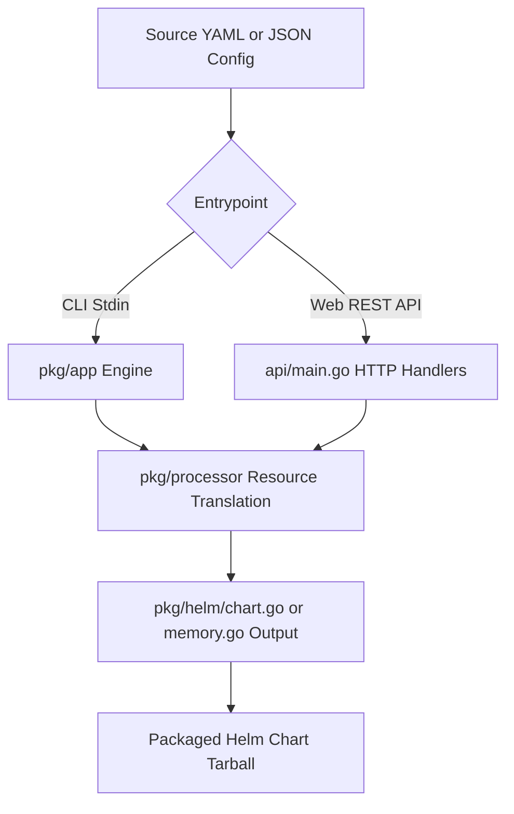

# Helmify
[](https://github.com/arttor/helmify/actions/workflows/ci.yml)


[](https://goreportcard.com/report/github.com/arttor/helmify)
[](https://pkg.go.dev/github.com/arttor/helmify?tab=doc)


CLI and Web API Service that creates [Helm](https://github.com/helm/helm) charts from Kubernetes manifests.

Helmify reads a list of [supported k8s objects](#status) from stdin or files, and parses/translates them into a standardized, production-ready Helm chart layout. 

Supports `Helm >=v3.6.0`

Submit an issue if some features are missing for your use-case.

---

## 🏗️ Repository Architecture & Modules

To makePair-programming or editing with Agent instances easier, here is the architectural structure of the project:

### 1. Modules Overview
- **Core Processing Engine (`/pkg`)**: Holds the core translator logic.
  - `pkg/processor`: Modular processors for parsing individual Kubernetes resources (Deployments, Services, ConfigMaps, routes, etc.).
  - `pkg/helm`: Handles writing generated outputs to the file system (`chart.go`) or compiling them in-memory (`memory.go`).
  - `pkg/helm/routes.go`: Handles dynamic/automated calculations for Route host subdomains.
- **Web API Service (`/api`)**: Embedded HTTP backend server.
  - `api/main.go`: API entry point. Implements endpoints for generating charts (`/v1/generate`), wizard payloads (`/v1/generate-wizard`), previews, and serving HTML.
  - `api/wizard.go`: Handler functions for the Wizard configuration workflows.
- **Web Frontend UIs (`/api/*.html`)**: Embedded rich web interfaces.
  - `api/index.html`: The **Chart Generator Wizard** (declarative component setup).
  - `api/converter.html`: The **Live YAML Converter** (real-time manifest translator).
  - `api/instructions.html`: Detailed REST API reference guide.
- **Helm Model Bases (`/models`)**: Embedded template baseline files.
  - `models/single`: Template file overrides and comments for single-deployment configurations.
  - `models/multi`: Template overrides for multi-deployment setups.

### 2. Execution Pathways


---

## Usage

1) As pipe:

    ```shell
    cat my-app.yaml | helmify mychart
    ```
   Will create 'mychart' directory with Helm chart from yaml file with k8s objects.

    ```shell
    awk 'FNR==1 && NR!=1  {print "---"}{print}' /<my_directory>/*.yaml | helmify mychart
    ```
   Will create 'mychart' directory with Helm chart from all yaml files in `<my_directory> `directory.

2) From filesystem:
    ```shell
    helmify -f /my_directory/my-app.yaml mychart
    ```
    Will create 'mychart' directory with Helm chart from `my_directory/my-app.yaml`.
    ```shell
    helmify -f /my_directory mychart
    ```
    Will create 'mychart' directory with Helm chart from all yaml files in `<my_directory> `directory.
    ```shell
    helmify -f /my_directory -r mychart
    ```
    Will create 'mychart' directory with Helm chart from all yaml files in `<my_directory> `directory recursively.
    ```shell
    helmify -f ./first_dir -f ./second_dir/my_deployment.yaml -f ./third_dir  mychart
    ```
    Will create 'mychart' directory with Helm chart from multiple directories and files.


3) From [kustomize](https://kustomize.io/) output:
    ```shell
    kustomize build <kustomize_dir> | helmify mychart
    ```
    Will create 'mychart' directory with Helm chart from kustomize output.

## Helmify API

Helmify can also be run as a web service, allowing you to generate charts via HTTP requests. This is useful for integrating Helmify into CI/CD pipelines or web-based tools.

### Routes

| Method | Route | Description |
|--------|-------|-------------|
| `GET` | `/healthz` | Health check endpoint. Returns `200 OK`. |
| `POST` | `/v1/generate` | Generates a Helm chart from the Kubernetes manifests sent in the request body. |

### API Usage Examples

#### Using a local manifest:
```bash
curl -X POST \
  -H "X-Chart-Name: my-chart" \
  --data-binary @my-app.yaml \
  http://<helmify-api-url>/v1/generate \
  --output my-chart.tar.gz
```

#### Using `kustomize` output:
```bash
kustomize build <dir> | curl -X POST \
  -H "X-Chart-Name: my-chart" \
  -H "X-Generate-All-Templates: true" \
  -H "X-Dev-Repo-Url: https://github.com/my-org/my-app" \
  --data-binary @- \
  http://<helmify-api-url>/v1/generate \
  --output my-chart.tar.gz
```

### Configuration Headers

You can configure the chart generation by sending the following optional headers:

| Header | Description |
|--------|-------------|
| `X-Chart-Name` | Name of the generated chart (default: `chart`). |
| `X-Crd` | Place CRDs in their own folder (default: `false`). |
| `X-Cert-Manager-Subchart` | Install cert-manager as a subchart (default: `false`). |
| `X-Cert-Manager-Install-Crd` | Install cert-manager CRDs (default: `true`). |
| `X-Add-Webhook-Option` | Adds an option to enable/disable webhook installation (default: `false`). |
| `X-Optional-Crds` | Enable optional CRD installation through values (default: `false`). |
| `X-Generate-All-Templates` | Generate all standard boilerplate templates (CM, Secret, Routes) for all components (default: `false`). |
| `X-Dev-Repo-Url` | TJPA developer source repository URL annotation for Chart.yaml (default: `""`). |

---

### Integrate to your Operator-SDK/Kubebuilder project

1. Open `Makefile` in your operator project generated by 
   [Operator-SDK](https://github.com/operator-framework/operator-sdk) or [Kubebuilder](https://github.com/kubernetes-sigs/kubebuilder).
2. Add these lines to `Makefile`:
- With operator-sdk version < v1.23.0 
    ```makefile
    HELMIFY = $(shell pwd)/bin/helmify
    helmify:
    	$(call go-get-tool,$(HELMIFY),github.com/arttor/helmify/cmd/helmify@v0.3.7)
    
    helm: manifests kustomize helmify
    	$(KUSTOMIZE) build config/default | $(HELMIFY)
    ```
- With operator-sdk version >= v1.23.0
    ```makefile
    HELMIFY ?= $(LOCALBIN)/helmify
    
    .PHONY: helmify
    helmify: $(HELMIFY) ## Download helmify locally if necessary.
    $(HELMIFY): $(LOCALBIN)
    	test -s $(LOCALBIN)/helmify || GOBIN=$(LOCALBIN) go install github.com/arttor/helmify/cmd/helmify@latest
        
    helm: manifests kustomize helmify
    	$(KUSTOMIZE) build config/default | $(HELMIFY)
    ```
3. Run `make helm` in project root. It will generate helm chart with name 'chart' in 'chart' directory.

## Install

With [Homebrew](https://brew.sh/) (for MacOS or Linux): `brew install arttor/tap/helmify`

Or download suitable for your system binary from [the Releases page](https://github.com/arttor/helmify/releases/latest).
Unpack the helmify binary and add it to your PATH and you are good to go!

## Available options
Helmify takes a chart name for an argument.
Usage:

```helmify [flags] CHART_NAME```  -  `CHART_NAME` is optional. Default is 'chart'. Can be a directory, e.g. 'deploy/charts/mychart'.

| flag                      | description                                                                                                                                                                                                 | sample                              |
|---------------------------|-------------------------------------------------------------------------------------------------------------------------------------------------------------------------------------------------------------|-------------------------------------|
| -h -help                  | Prints help                                                                                                                                                                                                 | `helmify -h`                        |
| -f                        | File source for k8s manifests (directory or file), multiple sources supported                                                                                                                               | `helmify -f ./test_data`            |
| -r                        | Scan file directory recursively. Used only if -f provided                                                                                                                                                   | `helmify -f ./test_data -r`         |
| -v                        | Enable verbose output. Prints WARN and INFO.                                                                                                                                                                | `helmify -v`                        |
| -vv                       | Enable very verbose output. Also prints DEBUG.                                                                                                                                                              | `helmify -vv`                       |
| -version                  | Print helmify version.                                                                                                                                                                                      | `helmify -version`                  |
| -crd-dir                  | Place crds in their own folder per Helm 3 [docs](https://helm.sh/docs/chart_best_practices/custom_resource_definitions/#method-1-let-helm-do-it-for-you). Caveat: CRDs templating is not supported by Helm. | `helmify -crd-dir`                  |
| -image-pull-secrets       | Allows the user to use existing secrets as imagePullSecrets                                                                                                                                                 | `helmify -image-pull-secrets`       |
| -original-name            | Use the object's original name instead of adding the chart's release name as the common prefix.                                                                                                             | `helmify -original-name`            |
| -cert-manager-as-subchart | Allows the user to install cert-manager as a subchart                                                                                                                                                       | `helmify -cert-manager-as-subchart` |
| -cert-manager-version     | Allows the user to specify cert-manager subchart version. Only useful with cert-manager-as-subchart. (default "v1.12.2")                                                                                    | `helmify -cert-manager-version=v1.12.2`    |
| -cert-manager-install-crd     | Allows the user to install cert-manager CRD as part of the cert-manager subchart.(default "true")                                                                                                           | `helmify -cert-manager-install-crd` |
| -preserve-ns              | Allows users to use the object's original namespace instead of adding all the resources to a common namespace. (default "false")                                                                            | `helmify -preserve-ns`              |
| -add-webhook-option | Adds an option to enable/disable webhook installation  | `helmify -add-webhook-option`|
| -optional-crds | Enable optional CRD installation through values. | `helmify -optional-crds` |
## Production Standards (TJPA compliant)

Helmify is designed to generate production-ready charts that follow TJPA standards:
- **Zero-Default Architecture**: Unopinionated templates that only render resources explicitly defined in `values.yaml`.
- **Fail-Fast Health Probes**: Automated 3-tier health probes (Startup, Liveness, Readiness) with default TCP fallback for exposed ports.
- **Global Configuration**: Centralized environment settings via `cm-global.yaml` and automatic `envFrom` injection.
- **Deterministic Rollouts**: Automatic SHA256 checksum annotations on PodSpecs to trigger restarts when configurations change.
- **Standardized Labels**: Consistent application of `component` and `part-of` labels across all resources.

## Status
Supported k8s resources:
- Deployment, DaemonSet, StatefulSet
- Job, CronJob
- Service, Ingress
- PersistentVolumeClaim
- RBAC (ServiceAccount, (cluster-)role, (cluster-)roleBinding)
- configs (ConfigMap, Secret)
- webhooks (cert, issuer, ValidatingWebhookConfiguration)
- custom resource definitions (CRD)

### Known issues
- Helmify will not overwrite `Chart.yaml` file if presented. Done on purpose.
- Helmify will not delete existing template files, only overwrite.
- Helmify overwrites templates and values files on every run. 
  This means that all your manual changes in helm template files will be lost on the next run.
- if switching between the using the `-crd-dir` flag it is better to delete and regenerate the from scratch to ensure crds are not accidentally spliced/formatted into the same chart. Bear in mind you will want to update your `Chart.yaml` thereafter.
  
## Develop
To support a new type of k8s object template:
1. Implement `helmify.Processor` interface. Place implementation in `pkg/processor`. The package contains 
examples for most k8s objects.
2. Register your processor in the `pkg/app/app.go`
3. Add relevant input sample to `test_data/kustomize.output`.


### Run
Clone repo and execute command:

```shell
cat test_data/k8s-operator-kustomize.output | go run ./cmd/helmify mychart
```

Will generate `mychart` Helm chart form file `test_data/k8s-operator-kustomize.output` representing typical operator
[kustomize](https://github.com/kubernetes-sigs/kustomize) output.

### Test
For manual testing, run program with debug output:
```shell
cat test_data/k8s-operator-kustomize.output | go run ./cmd/helmify -vv mychart
```
Then inspect logs and generated chart in `./mychart` directory.

To execute tests, run:
```shell
go test ./...
```
Beside unit-tests, project contains e2e test `pkg/app/app_e2e_test.go`.
It's a go test, which uses `test_data/*` to generate a chart in temporary directory. 
Then runs `helm lint --strict` to check if generated chart is valid.

## Contribute

Following rules will help changes to be accepted faster:
- For more than one-line bugfixes consider creating an issue with bug description or feature request
- For feature request try to think about and cover following topics (when applicable):
  - Motivation: why feature is needed? Which problem does it solve? What is current workaround?
  - Backward-compatibility: existing users expect that after upgrading helmify version their existing generated charts wont be changed without consent.
- For bugfix PR consider adding example to [/test_data](./test_data/) source yamls reproducing bug.

### Contribution flow

Check list before submitting PR:
1. Run `go fmt ./...`
2. Run tests `go test ./...`
3. Update chart examples:
   ```shell
   cat test_data/sample-app.yaml | go run ./cmd/helmify examples/app
   ```
   ```shell
   cat test_data/k8s-operator-kustomize.output | go run ./cmd/helmify examples/operator
   ```
4. In case of long commit history (more than 3) squash local commits into one
