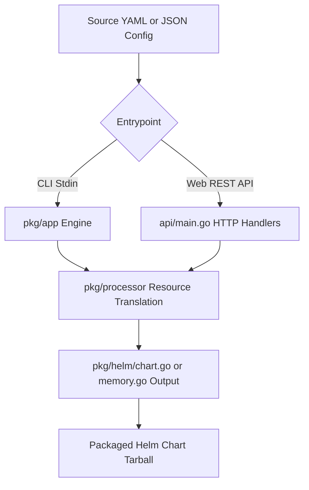

# Helmify
[](https://github.com/arttor/helmify/actions/workflows/ci.yml)
[Documentation](docs/index.md)


[](https://goreportcard.com/report/github.com/arttor/helmify)
[](https://pkg.go.dev/github.com/arttor/helmify?tab=doc)


CLI and Web API Service that creates [Helm](https://github.com/helm/helm) charts from Kubernetes manifests.

Helmify reads a list of [supported k8s objects](#status) from stdin or files, and parses/translates them into a standardized, production-ready Helm chart layout. 

Supports `Helm >=v3.6.0`

Submit an issue if some features are missing for your use-case.

---

## 🏗️ Repository Architecture & Modules

To makePair-programming or editing with Agent instances easier, here is the architectural structure of the project:

### 1. Modules Overview
- **Core Processing Engine (`/pkg`)**: Holds the core translator logic.
  - `pkg/processor`: Modular processors for parsing individual Kubernetes resources (Deployments, Services, ConfigMaps, routes, etc.).
  - `pkg/helm`: Handles writing generated outputs to the file system (`chart.go`) or compiling them in-memory (`memory.go`).
  - `pkg/helm/routes.go`: Handles dynamic/automated calculations for Route host subdomains.
- **Web API Service (`/api`)**: Embedded HTTP backend server.
  - `api/main.go`: API entry point. Implements endpoints for generating charts (`/v1/generate`), wizard payloads (`/v1/generate-wizard`), previews, and serving HTML.
  - `api/wizard.go`: Handler functions for the Wizard configuration workflows.
- **Web Frontend UIs (`/api/*.html`)**: Embedded rich web interfaces.
  - `api/index.html`: The **Chart Generator Wizard** (declarative component setup).
  - `api/converter.html`: The **Live YAML Converter** (real-time manifest translator).
  - `api/instructions.html`: Detailed REST API reference guide.
- **Helm Model Bases (`/models`)**: Embedded template baseline files.
  - `models/single`: Template file overrides and comments for single-deployment configurations.
  - `models/multi`: Template overrides for multi-deployment setups.

### 2. Execution Pathways


### 3. Recent Updates & TJPA Customizations
This fork incorporates specific behaviors designed to meet organizational requirements:

- **Universal Global Configurations (`cm-global.yaml` & `secret-global.yaml`):**
  Helmify now universally preserves and generates the `global` values block and associated `cm-global.yaml` and `secret-global.yaml` templates for both **Single-Component** and **Multi-Component** charts. This ensures robust `envFrom` references and predictable `sha256sum` injections without template resolution errors in deployment manifests.
- **Environment Variable Deduplication (`envFrom`):**
  Helmify extracts ConfigMap and Secret environment variables into `values.yaml`. The deployment spec's explicit `env` variables are dynamically stripped when they become redundant via `envFrom`. This now correctly uses normalized component comparisons to reliably drop all duplicate variable mappings.
  - Suffix Simplifications: Single-component resources (like `cm` and `secret`) no longer duplicate the component name in their file suffixes or `envFrom` references (e.g., using `{{ include "fullname" . }}-cm` instead of `<fullname>-<component>-cm`).
- **Labels and Annotations Strategy:**
  - Resource Selectors: `app.kubernetes.io/component` has been stripped from standard `matchLabels` to prevent upgrade-related immutable field conflicts in Deployments.
  - Resource Metadata: Primary objects (Deployments, Services, ConfigMaps, Secrets, Routes) still receive the `app.kubernetes.io/component: {{ include "chart.fullname" . }}-<componentName>` label in their `.metadata.labels` to accurately classify them in OpenShift monitoring panels.
- **UI Code Preview Reliability:**
  The `yaml` streaming decoder inside the web API has been hardened to aggressively abort on syntax errors. This resolves a known bug where pasting malformed YAML or half-typed templates into the UI wizard would trigger an unrecoverable infinite loop, locking up the CPU and freezing the `/v1/preview` API.

---

## Usage

1) As pipe:

    ```shell
    cat my-app.yaml | helmify mychart
    ```
   Will create 'mychart' directory with Helm chart from yaml file with k8s objects.

    ```shell
    awk 'FNR==1 && NR!=1  {print "---"}{print}' /<my_directory>/*.yaml | helmify mychart
    ```
   Will create 'mychart' directory with Helm chart from all yaml files in `<my_directory> `directory.

2) From filesystem:
    ```shell
    helmify -f /my_directory/my-app.yaml mychart
    ```
    Will create 'mychart' directory with Helm chart from `my_directory/my-app.yaml`.
    ```shell
    helmify -f /my_directory mychart
    ```
    Will create 'mychart' directory with Helm chart from all yaml files in `<my_directory> `directory.
    ```shell
    helmify -f /my_directory -r mychart
    ```
    Will create 'mychart' directory with Helm chart from all yaml files in `<my_directory> `directory recursively.
    ```shell
    helmify -f ./first_dir -f ./second_dir/my_deployment.yaml -f ./third_dir  mychart
    ```
    Will create 'mychart' directory with Helm chart from multiple directories and files.


3) From [kustomize](https://kustomize.io/) output:
    ```shell
    kustomize build <kustomize_dir> | helmify mychart
    ```
    Will create 'mychart' directory with Helm chart from kustomize output.

## Helmify API

Helmify can also be run as a web service, allowing you to generate charts via HTTP requests. This is useful for integrating Helmify into CI/CD pipelines or web-based tools.

### Routes

| Method | Route | Description |
|--------|-------|-------------|
| `GET` | `/healthz` | Health check endpoint. Returns `200 OK`. |
| `POST` | `/v1/generate` | Generates a Helm chart from the Kubernetes manifests sent in the request body. |

### API Usage Examples

#### Using a local manifest:
```bash
curl -X POST \
  -H "X-Chart-Name: my-chart" \
  --data-binary @my-app.yaml \
  http://<helmify-api-url>/v1/generate \
  --output my-chart.tar.gz
```

#### Using `kustomize` output:
```bash
kustomize build <dir> | curl -X POST \
  -H "X-Chart-Name: my-chart" \
  -H "X-Generate-All-Templates: true" \
  -H "X-Dev-Repo-Url: https://github.com/my-org/my-app" \
  --data-binary @- \
  http://<helmify-api-url>/v1/generate \
  --output my-chart.tar.gz
```

### Configuration Headers

You can configure the chart generation by sending the following optional headers:

| Header | Description |
|--------|-------------|
| `X-Chart-Name` | Name of the generated chart (default: `chart`). |
| `X-Crd` | Place CRDs in their own folder (default: `false`). |
| `X-Cert-Manager-Subchart` | Install cert-manager as a subchart (default: `false`). |
| `X-Cert-Manager-Install-Crd` | Install cert-manager CRDs (default: `true`). |
| `X-Add-Webhook-Option` | Adds an option to enable/disable webhook installation (default: `false`). |
| `X-Optional-Crds` | Enable optional CRD installation through values (default: `false`). |
| `X-Generate-All-Templates` | Generate all standard boilerplate templates (CM, Secret, Routes) for all components (default: `false`). |
| `X-Dev-Repo-Url` | TJPA developer source repository URL annotation for Chart.yaml (default: `""`). |

---

### Integrate to your Operator-SDK/Kubebuilder project

1. Open `Makefile` in your operator project generated by 
   [Operator-SDK](https://github.com/operator-framework/operator-sdk) or [Kubebuilder](https://github.com/kubernetes-sigs/kubebuilder).
2. Add these lines to `Makefile`:
- With operator-sdk version < v1.23.0 
    ```makefile
    HELMIFY = $(shell pwd)/bin/helmify
    helmify:
    	$(call go-get-tool,$(HELMIFY),github.com/arttor/helmify/cmd/helmify@v0.3.7)
    
    helm: manifests kustomize helmify
    	$(KUSTOMIZE) build config/default | $(HELMIFY)
    ```
- With operator-sdk version >= v1.23.0
    ```makefile
    HELMIFY ?= $(LOCALBIN)/helmify
    
    .PHONY: helmify
    helmify: $(HELMIFY) ## Download helmify locally if necessary.
    $(HELMIFY): $(LOCALBIN)
    	test -s $(LOCALBIN)/helmify || GOBIN=$(LOCALBIN) go install github.com/arttor/helmify/cmd/helmify@latest
        
    helm: manifests kustomize helmify
    	$(KUSTOMIZE) build config/default | $(HELMIFY)
    ```
3. Run `make helm` in project root. It will generate helm chart with name 'chart' in 'chart' directory.

## Install

With [Homebrew](https://brew.sh/) (for MacOS or Linux): `brew install arttor/tap/helmify`

Or download suitable for your system binary from [the Releases page](https://github.com/arttor/helmify/releases/latest).
Unpack the helmify binary and add it to your PATH and you are good to go!

## Available options
Helmify takes a chart name for an argument.
Usage:

```helmify [flags] CHART_NAME```  -  `CHART_NAME` is optional. Default is 'chart'. Can be a directory, e.g. 'deploy/charts/mychart'.

| flag                      | description                                                                                                                                                                                                 | sample                              |
|---------------------------|-------------------------------------------------------------------------------------------------------------------------------------------------------------------------------------------------------------|-------------------------------------|
| -h -help                  | Prints help                                                                                                                                                                                                 | `helmify -h`                        |
| -f                        | File source for k8s manifests (directory or file), multiple sources supported                                                                                                                               | `helmify -f ./test_data`            |
| -r                        | Scan file directory recursively. Used only if -f provided                                                                                                                                                   | `helmify -f ./test_data -r`         |
| -v                        | Enable verbose output. Prints WARN and INFO.                                                                                                                                                                | `helmify -v`                        |
| -vv                       | Enable very verbose output. Also prints DEBUG.                                                                                                                                                              | `helmify -vv`                       |
| -version                  | Print helmify version.                                                                                                                                                                                      | `helmify -version`                  |
| -crd-dir                  | Place crds in their own folder per Helm 3 [docs](https://helm.sh/docs/chart_best_practices/custom_resource_definitions/#method-1-let-helm-do-it-for-you). Caveat: CRDs templating is not supported by Helm. | `helmify -crd-dir`                  |
| -image-pull-secrets       | Allows the user to use existing secrets as imagePullSecrets                                                                                                                                                 | `helmify -image-pull-secrets`       |
| -original-name            | Use the object's original name instead of adding the chart's release name as the common prefix.                                                                                                             | `helmify -original-name`            |
| -cert-manager-as-subchart | Allows the user to install cert-manager as a subchart                                                                                                                                                       | `helmify -cert-manager-as-subchart` |
| -cert-manager-version     | Allows the user to specify cert-manager subchart version. Only useful with cert-manager-as-subchart. (default "v1.12.2")                                                                                    | `helmify -cert-manager-version=v1.12.2`    |
| -cert-manager-install-crd     | Allows the user to install cert-manager CRD as part of the cert-manager subchart.(default "true")                                                                                                           | `helmify -cert-manager-install-crd` |
| -preserve-ns              | Allows users to use the object's original namespace instead of adding all the resources to a common namespace. (default "false")                                                                            | `helmify -preserve-ns`              |
| -add-webhook-option | Adds an option to enable/disable webhook installation  | `helmify -add-webhook-option`|
| -optional-crds | Enable optional CRD installation through values. | `helmify -optional-crds` |
## Production Standards (TJPA compliant)

Helmify is designed to generate production-ready charts that follow TJPA standards:
- **Zero-Default Architecture**: Unopinionated templates that only render resources explicitly defined in `values.yaml`.
- **Fail-Fast Health Probes**: Automated 3-tier health probes (Startup, Liveness, Readiness) with default TCP fallback for exposed ports.
- **Global Configuration**: Centralized environment settings via `cm-global.yaml` and automatic `envFrom` injection.
- **Deterministic Rollouts**: Automatic SHA256 checksum annotations on PodSpecs to trigger restarts when configurations change.
- **Deployment Strategy**: If a strategy is defined in the source manifest, it is preserved in the generated values. Otherwise, it defaults to a standardized `RollingUpdate` strategy (`maxUnavailable: 0`, `maxSurge: 25%`) to guarantee zero-downtime rolling updates.
- **Standardized Labels**: Consistent application of `component` and `part-of` labels across all resources. The `app.kubernetes.io/component` label dynamically checks the deployment type: if it is a single-deployment chart (component name matches chart name), it renders simply as `{{ include "<chartName>.fullname" . }}` to avoid duplicate suffixes like `token-tjpa-token-tjpa`. Otherwise, it templates as `{{ include "<chartName>.fullname" . }}-<componentName>`.
- **Dynamic Route Association**: Automatically associates OpenShift Routes with their target `Service` components by checking the target `spec.to.name`. If a Route targets a Service belonging to the same component, it maps to `.Values.<component>.route`. If it routes to a Service in a different component (additional routes), it is isolated under `.Values.<component>.routes.<routeName>` to prevent configuration overrides.

## Component Naming & Reference Resolution Engine

To prevent naming inconsistencies and duplicate templates (such as `cm-foo.yaml` and `cm-foobar.yaml`), Helmify implements a naming and reference matching algorithm:

1. **Component Name Extraction (`GetComponent`)**:
   - Component names are parsed from resource names (e.g. stripping suffixes like `-deploy`, `-svc`, `-cm`, `-secret`) and normalized to lowercase kebab-case.
   - A suffix matching list (e.g., `-judiciaria`) is checked to prevent stripping names prematurely. If name-matching rules differ between local and remote codebases, it causes different resolved component names (e.g. `adm-estrutura` vs `adm-estrutura-judiciaria`).

2. **Reference Resolution (`FindReferencingComponents`)**:
   - When a ConfigMap or Secret is parsed, Helmify scans all active workload resources (Deployments, StatefulSets, etc.) to see which component references them via `envFrom`, `valueFrom` (ConfigMapKeyRef/SecretKeyRef), or volumes.
   - If a ConfigMap/Secret is referenced by a workload, its values in `values.yaml` are grouped under that workload's camel-cased component name (e.g. `.Values.admEstruturaJudiciaria`).

3. **Template References Alignment**:
   - Workload templates (like `deploy-backend.yaml`) use `TemplatedConfigMapName` and `TemplatedSecretName` to dynamically update inline references in container definitions (e.g., changing a raw ConfigMap name like `adm-estrutura-judiciaria-configmap` to `{{ include "fullname" . }}-adm-estrutura-judiciaria-cm`).
    - If there is a version mismatch between the deployed Helmify API and your local branch, the template names and values keys can diverge (e.g., writing the ConfigMap with name `adm-estrutura` but referencing `adm-estrutura-judiciaria` in the Deployment). **Always ensure the remote server is running the same commit as your local branch to keep naming consistent.**

## Manifest Validation Checklist (Before Helmifying)

Before sending your manifests to the Helmify API or CLI, run the following verification steps to ensure correct template generation and naming alignment:

1. **Shared ConfigMaps / Secrets Verification**:
   - Check if any ConfigMap or Secret is referenced by more than one workload (e.g., used by both frontend and backend).
   - If referenced by multiple workloads, Helmify will treat it as a **global resource** (`cm-global.yaml`/`secret-global.yaml`), grouping its values under `.Values.global.cm` or `.Values.global.secret`.
   - Ensure that this shared config behavior matches your project architecture design.

2. **Suffix Collision Check**:
   - Check resource names for suffixes that are exactly 10 lowercase alphanumeric characters long (e.g. `*-judiciaria`).
   - Suffixes matching the `[-.][a-z0-9]{10}$` pattern will be stripped automatically by Helmify as if they were Kustomize generated hashes.
   - If a suffix is stripped from some resources but not others, it will lead to component naming mismatches. Ensure any 10-character custom suffixes are whitelisted in `StripKustomizeHash` or rename the resources.

3. **Route Target Verification**:
   - Check that all `Route` objects have `spec.to.name` targeting valid `Service` names present in the input.
   - Routes targeting a service belonging to the same component will map to `.Values.<component>.route`.
   - Routes targeting a service belonging to a different component will map as additional routes under `.Values.<component>.routes.<routeName>`.

4. **Kustomize Build Compilation**:
   - Always run `kustomize build <dir>` locally and check for syntax errors before piping the output to `helmify`.

## Status
Supported k8s resources:
- Deployment, DaemonSet, StatefulSet
- Job, CronJob
- Service, Ingress, Route (OpenShift)
- PersistentVolumeClaim
- RBAC (ServiceAccount, (cluster-)role, (cluster-)roleBinding)
- configs (ConfigMap, Secret)
- webhooks (cert, issuer, ValidatingWebhookConfiguration)
- custom resource definitions (CRD)

### Known issues
- Helmify will not overwrite `Chart.yaml` file if presented. Done on purpose.
- Helmify will not delete existing template files, only overwrite.
- Helmify overwrites templates and values files on every run. 
  This means that all your manual changes in helm template files will be lost on the next run.
- if switching between the using the `-crd-dir` flag it is better to delete and regenerate the from scratch to ensure crds are not accidentally spliced/formatted into the same chart. Bear in mind you will want to update your `Chart.yaml` thereafter.
  
## Develop
To support a new type of k8s object template:
1. Implement `helmify.Processor` interface. Place implementation in `pkg/processor`. The package contains 
examples for most k8s objects.
2. Register your processor in the `pkg/app/app.go`
3. Add relevant input sample to `test_data/kustomize.output`.


### Run
Clone repo and execute command:

```shell
cat test_data/k8s-operator-kustomize.output | go run ./cmd/helmify mychart
```

Will generate `mychart` Helm chart form file `test_data/k8s-operator-kustomize.output` representing typical operator
[kustomize](https://github.com/kubernetes-sigs/kustomize) output.

### Test
For manual testing, run program with debug output:
```shell
cat test_data/k8s-operator-kustomize.output | go run ./cmd/helmify -vv mychart
```
Then inspect logs and generated chart in `./mychart` directory.

To execute tests, run:
```shell
go test ./...
```
Beside unit-tests, project contains e2e test `pkg/app/app_e2e_test.go`.
It's a go test, which uses `test_data/*` to generate a chart in temporary directory. 
Then runs `helm lint --strict` to check if generated chart is valid.

## Contribute

Following rules will help changes to be accepted faster:
- For more than one-line bugfixes consider creating an issue with bug description or feature request
- For feature request try to think about and cover following topics (when applicable):
  - Motivation: why feature is needed? Which problem does it solve? What is current workaround?
  - Backward-compatibility: existing users expect that after upgrading helmify version their existing generated charts wont be changed without consent.
- For bugfix PR consider adding example to [/test_data](./test_data/) source yamls reproducing bug.

### Contribution flow

Check list before submitting PR:
1. Run `go fmt ./...`
2. Run tests `go test ./...`
3. Update chart examples:
   ```shell
   cat test_data/sample-app.yaml | go run ./cmd/helmify examples/app
   ```
   ```shell
   cat test_data/k8s-operator-kustomize.output | go run ./cmd/helmify examples/operator
   ```
4. In case of long commit history (more than 3) squash local commits into one

---

## ⚠️ Known Issues: Deployed Version Mismatch (Diagnostic Report)

### Symptom
When generating charts via the remote Helmify API service, you may observe duplicate template files (e.g., `cm-adm-estrutura.yaml` and `cm-admestrutura.yaml`, or `secret-adm-estrutura.yaml` and `secret-admestrutura.yaml`) and name resolution mismatches inside the `Deployment` env/envFrom references.

### Cause
The remote Helmify API instance running on OpenShift (`https://helmify.apps.ocp-dev.i.tj.pa.gov.br`) is currently running an **outdated version** built from the `gitlab/main` branch (last commit: June 12, `38ff265`).

The local/upstream `main` branch contains **24 commits of bug fixes and feature additions** since then, including:
1. **Commit `9bc1752`**: `fix: prevent premature stripping of common suffixes...`
2. **Commit `ad1e253`**: `refactor: standardize configmap and secret naming resolution...`
3. **Commit `5df8dcd`**: `refactor: normalize component names, improve route mapping logic...`

Because these fixes are not yet deployed on the remote server, the server uses the old heuristic for component resolution, leading to inconsistent naming between the core workload and the configmaps/secrets.

### Solution
Push the updated local `main` branch commits to the GitLab remote repository to trigger the CI/CD pipeline and redeploy the latest API service to OpenShift:
```bash
git push gitlab main:main
```
Once the pipeline completes, generating the chart again via the API will produce clean, aligned, and optimized templates with no duplicates or invalid references.

### 🐛 10-Character Suffix Collision Bug (`judiciaria`)
A secondary root cause of component name divergence is the Kustomize hash stripping logic:
- Kustomize configuration hash suffix detection uses the regex `[-.][a-z0-9]{10}$`.
- The word `"judiciaria"` contains exactly **10 lowercase characters**.
- Consequently, resource names ending in `-judiciaria` (e.g. `adm-estrutura-judiciaria` Deployment, Service, and Route) have their suffix stripped by `StripKustomizeHash` to `"adm-estrutura"`.
- ConfigMaps and Secrets whose names end with other suffixes (like `-configmap` or `-secrets`) are NOT stripped, leading to inconsistent component resolution (e.g., workload resolving to component `adm-estrutura` but ConfigMap resolving to component `adm-estrutura-judiciaria` / values path `admEstruturaJudiciariaConfigmap`).
- **Fix**: Whitelist `judiciaria` suffix in `StripKustomizeHash` within both [metadata.go](file:///home/danilo.nicioka/git/hub/helmify/pkg/metadata/metadata.go#L53) and [meta.go](file:///home/danilo.nicioka/git/hub/helmify/pkg/processor/meta.go#L266) to prevent stripping.

### 🔢 Numeric Component Suffix Mapping Bug (`1G` / `2G`)
When components end with numeric suffixes (like `pje-service-1g` or `pje-service-2g`):
- `strcase.ToKebab` transforms `"1g"` / `"2g"` to `"1-g"` / `"2-g"` and `"pje-service-1g"` to `"pje-service-1-g"`.
- Because `"1-g"`, `"2-g"`, `"pje-service-1-g"`, and `"pje-service-2-g"` were missing from the switch cases inside `NormalizeComponentName`, they were returned as-is.
- This bypassed normalization and was camel-cased by `ToLowerCamel` into `.Values.1G` and `.Values.2G` for Services/Routes (due to delimiter parsing rules), while Deployments mapped to `.Values.pjeService1G` and `.Values.pjeService2G`.
- This mismatch caused Helm rendering syntax errors since Helm variables cannot start with a number.
- **Fix**: Whitelist the kebab-cased keys `"1-g"`, `"2-g"`, `"pje-service-1-g"`, and `"pje-service-2-g"` inside `NormalizeComponentName` switch cases within [meta.go](file:///home/danilo.nicioka/git/hub/helmify/pkg/processor/meta.go#L403-L406) to ensure they resolve consistently to `pje-service-1g` and `pje-service-2g`.

### 🔄 Global Values.yaml Ordering Bug
- **Symptom**: The `global:` block in `values.yaml` rendered at the very top of the file, prior to section `I. CHART-WIDE OPTIONS` (`kubernetesClusterDomain` etc.).
- **Cause**: The key priority assignment logic in `getPriority` (inside `chart.go`) assigned a weight of `-5` to the `global` key, causing it to sort before `kubernetesClusterDomain` (priority `-4`).
- **Fix**: Adjusted priorities in `chart.go` to assign `global` a weight of `-1`, placing it after `fullnameOverride` (`-3`) and aligning it with the multi-deployment model layout.

### 🏷️ Fullname-Prefixed Component Labels (`app.kubernetes.io/component`)
- **Symptom**: Generated templates copied static `app.kubernetes.io/component` values from raw manifests, whereas the TJPA Helm models require component labels to be dynamically prefixed with the chart fullname.
- **Fix**: Updated `ProcessObjMeta` ([meta.go](file:///home/danilo.nicioka/git/hub/helmify/pkg/processor/meta.go)) and the Route processor ([route.go](file:///home/danilo.nicioka/git/hub/helmify/pkg/processor/route/route.go)) to template the label using the chart fullname helper:
  ```yaml
  app.kubernetes.io/component: {{ include "<chartName>.fullname" . }}-<componentName>
  ```
    - **Problem**: For charts that represent a *single* deployment, the component name equals the chart name. The previous templating added a duplicate suffix (e.g. `{{ include "token-tjpa.fullname" . }}-token-tjpa-secrets` → `token-tjpa-token-tjpa-secrets`).
    - **Cause**: The label templating always appended `-{{ .Values.<component> }}` without checking if the component name already matches the chart name.
    - **Solution**: Helmify now checks `if normalizedComp == appMeta.ChartName()` (or equivalent in routes) and, for single‑deployment charts, renders the component label simply as `{{ include "<chartName>.fullname" . }}`. For multi‑deployment charts the suffix is kept, ensuring distinct component labels.
    - **Caution**: When a chart defines **multiple** components (e.g., `frontend`, `backend`), the component name will differ from the chart name, so the suffix **must** remain. The logic safely preserves the suffix only when the names match.
    - **Implementation**: Updated `ProcessObjMeta` in `meta.go`, route templating in `route.go`, and the chart generation logic in `chart.go`. Also adjusted example Helm chart templates (`deploy.yaml`, `cm.yaml`, `secret.yaml`) to use generic `-cm` and `-secrets` names that Helmify resolves correctly.


### 🕸️ Dynamic OpenShift Topology Mapping (`app.openshift.io/connects-to`)
- **Problem**: Hardcoding the `app.openshift.io/connects-to` annotation in Service or Route templates limits flexibility and prevents workloads from dynamically declaring links to multiple deployments (e.g., API needing to connect to database/service workloads).
- **Implementation**: Handle this dynamically in the `Deployment` templates by referencing a `.Values.<component>.connectsTo` array in `values.yaml` and mapping it to the `app.openshift.io/connects-to` JSON list annotation:
  ```yaml
    {{- if .Values.<component>.connectsTo }}
    annotations:
      app.openshift.io/connects-to: '[
        {{- $first := true -}}
        {{- range $item := .Values.<component>.connectsTo -}}
          {{- if not $first }},{{- end -}}
          {{- $kind := "Deployment" -}}
          {{- $apiVersion := "apps/v1" -}}
          {{- $nameSuffix := "" -}}
          {{- if typeIs "string" $item -}}
            {{- $nameSuffix = $item -}}
          {{- else -}}
            {{- $kind = default "Deployment" $item.kind -}}
            {{- $apiVersion = default "apps/v1" $item.apiVersion -}}
            {{- $nameSuffix = $item.name -}}
          {{- end -}}
          {"apiVersion":"{{ $apiVersion }}","kind":"{{ $kind }}","name":"{{ include "<chartName>.fullname" $ }}-{{ $nameSuffix }}"}
          {{- $first = false -}}
        {{- end -}}
      ]'
    {{- end }}
  ```
### 🗺️ Route Service Target Naming Bug (-svc suffix)
- **Symptom**: When dynamically generating standard route templates (`route-default.yaml`, `route-int.yaml`, `route-ext.yaml`) using the `GenerateAllTemplates` option, the route manifests are generated referencing target services with a `-svc` suffix (e.g. `{{ include "fullname" . }}-svc`), causing routing errors in OpenShift since the actual generated service templates do not have the `-svc` suffix.
- **Fix**: Removed the hardcoded `-svc` suffix from `compRouteDefaultTemplate`, `compRouteInternalTemplate`, and `compRouteExternalTemplate` inside [chart.go](file:///home/danilo.nicioka/git/hub/helmify/pkg/helm/chart.go) to match the service templates.
- **Feature**: Helmify now ensures `extraAnnotations` and `extraLabels` placeholder maps exist in `values.yaml` for each component, enabling users to configure OpenShift topology annotations (`app.openshift.io/connects-to` and `console.alpha.openshift.io/overview-app-route`) without re‑generating the chart.
