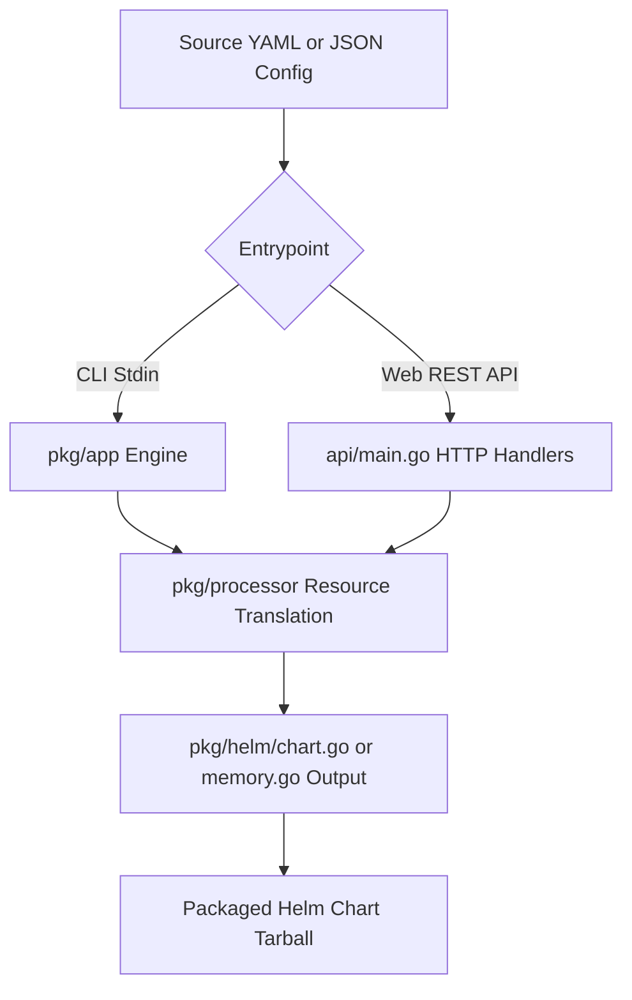

# Architecture

## Components
- **pkg/processor** – Implements `Processor` interface for each Kubernetes resource type (Deployments, Services, ConfigMaps, etc.).
- **pkg/helm** – Generates Helm templates (`.yaml` files) and `values.yaml` based on processed resources.
- **models/** – Base Helm template files used as scaffolding for generated charts. Separate directories for single‑deployment and multi‑deployment use‑cases.
- **api/** – Embedded HTTP service exposing `/v1/generate` and a web UI wizard for interactive chart creation.

The flow is: input → processors → model templates → final chart.
